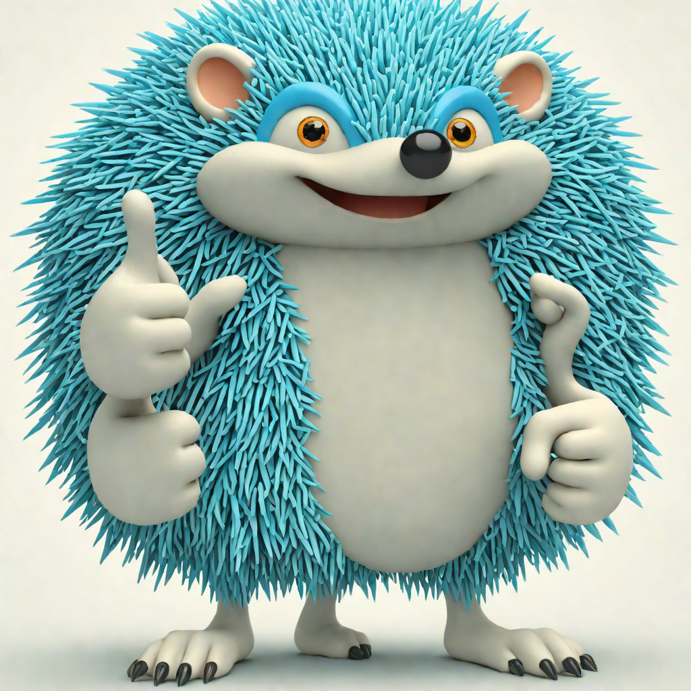
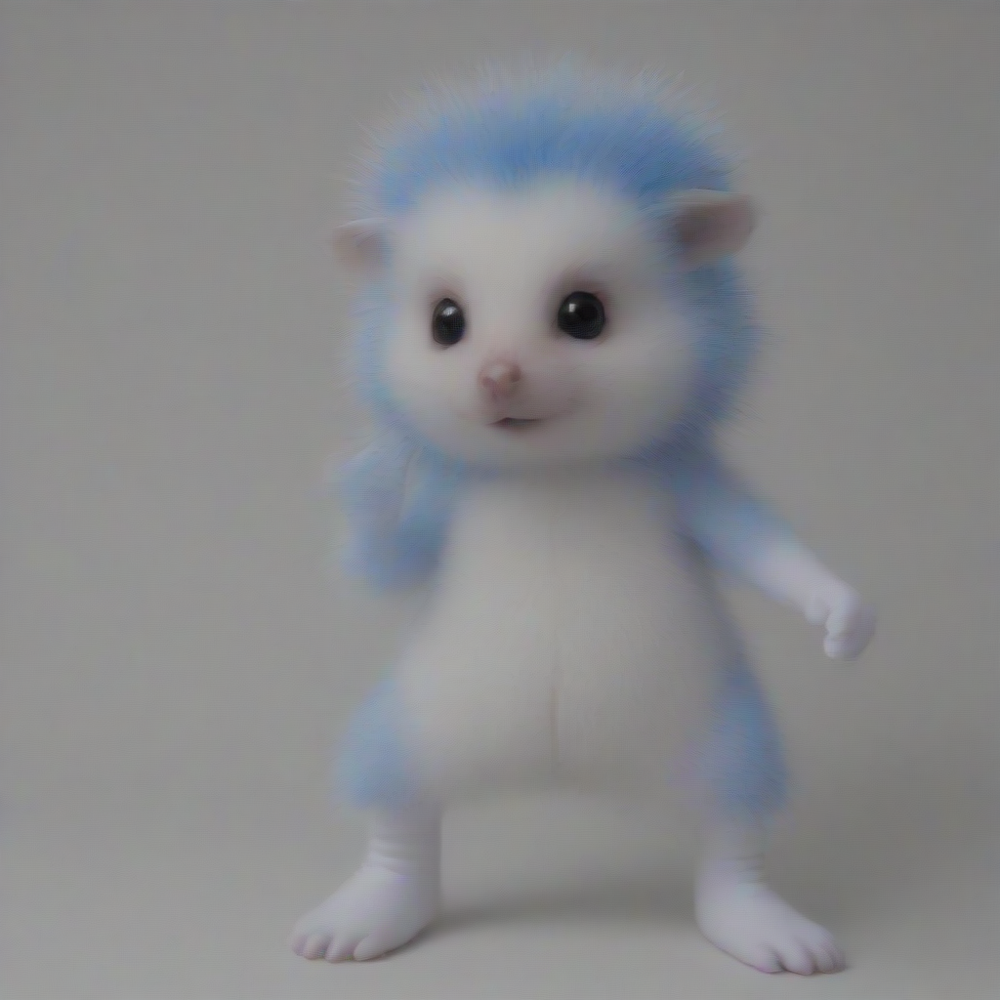
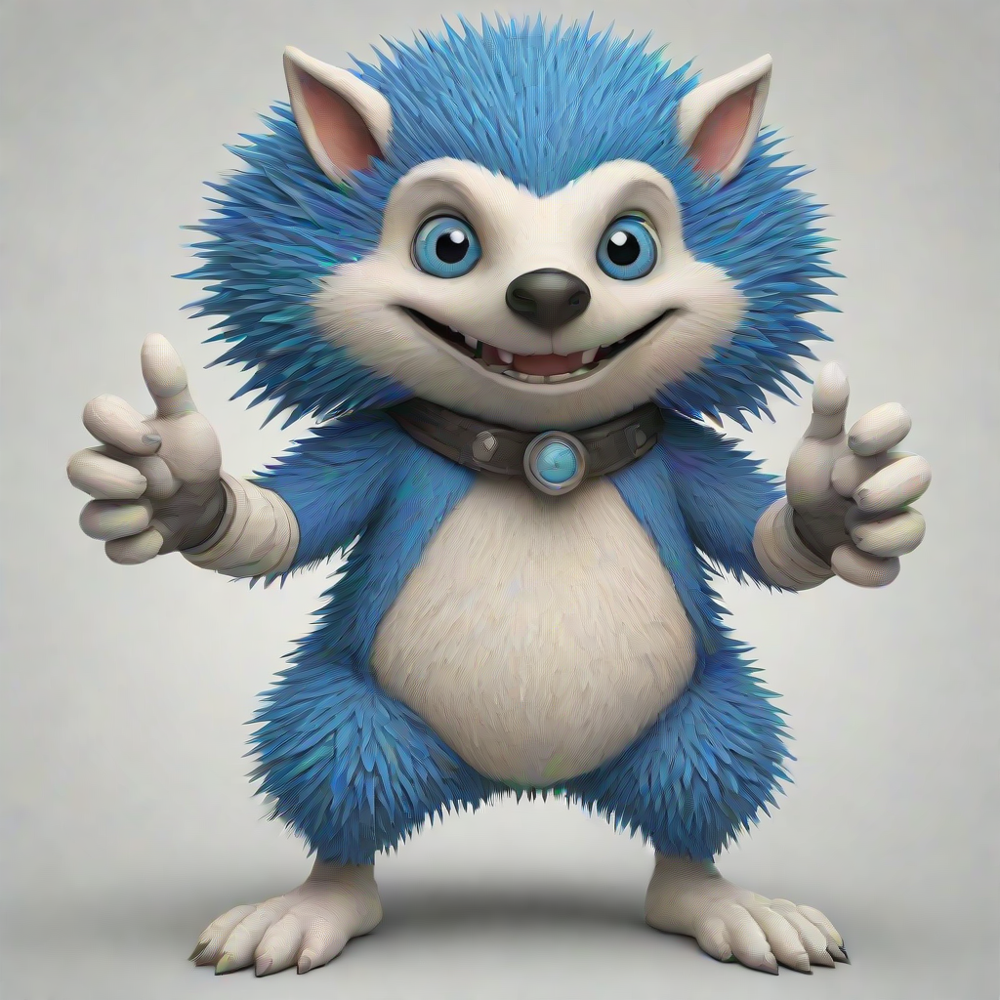

# safetensors-merge-supermario

Combine any two models using a Super Mario merge as described in the linked whitepaper.

## About

Combine capabilities from multiple models. Built for Stable Diffusion XL / Stable Diffusion XL Turbo but it matches any safetensor keys with the same name.

### Example

| **Model** | **Description** | **Image** |
|-----------|-----------------|-----------|
| **sd_xl_turbo** | Attempting 1024 | { width=100 height=100 } |
| **sdxl 1024** | Attempting to use SDTurboScheduler | { width=100 height=100 } |
| **merged** | - | { width=100 height=100 } |

## Usage

`python merge.py -p 0.1 -lambda 3 base_model.safetensors second_model.safetensors merged_output.safetensors`

Models:

References:
* [https://arxiv.org/pdf/2311.03099.pdf] (Language Models are Super Mario: Absorbing Abilities from Homologous Models as a Free Lunch)
